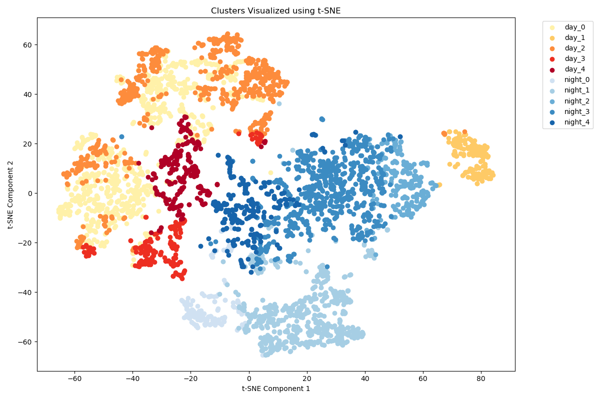
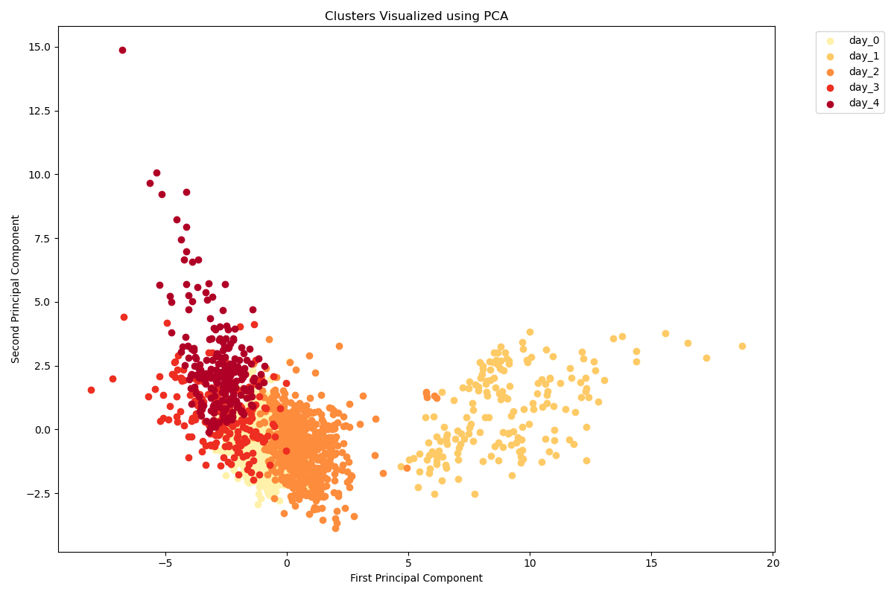
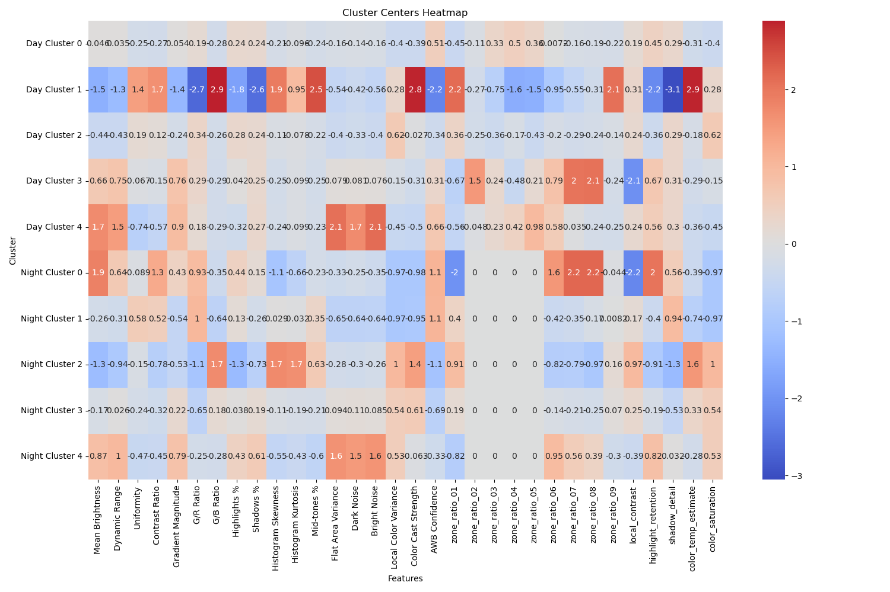

# Visualization and Clustering for RAOD dataset

[RAOD](https://github.com/huawei-noah/noah-research/tree/master/RAOD) dataset does not provide meta data to visualize the raw dataset, this repo aims to provide simple scripts to do that to help

1. simple visualization for eye-balling the the dataset.
2. Clustering RAOD dataset, so that ISP pipeline can be applied for further ablation study

## Raw to Image Visualization

- examples in `RAOD2image.py`
- handle both day and night images in RAOD

## Clusetring and cluster feature viualization

### Clusetring v0.7

- defined feature in `calc_groups.py`
- added multi-processing

### Visualization for clusterings

run `feature_eval.py`

### Example Graph

1. Cluster Visualization

2. feature visualizations

